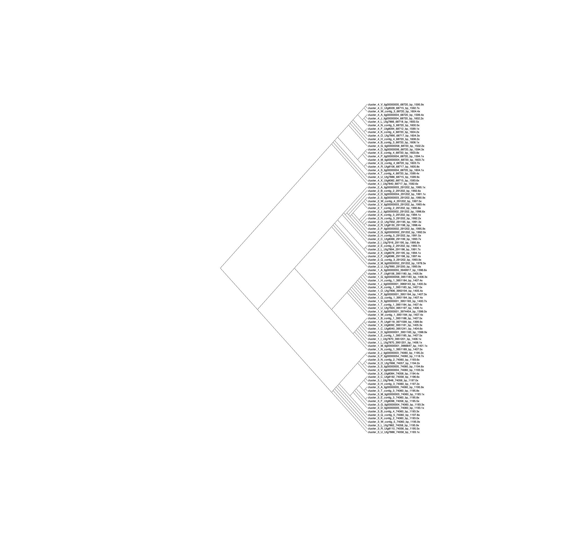
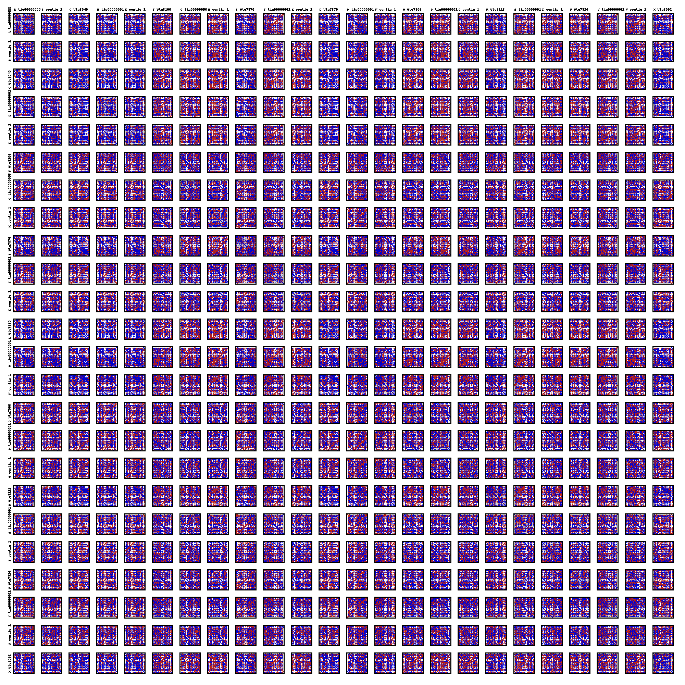

# *Phaeobacter inhibens* S4Sm genome assembly

Scripts and pipeline for consensus bacterial genome assembly using Trycycler

Current *P. inhibens* genomes: https://www.ncbi.nlm.nih.gov/genome/13044  
Our strain S4Sm: https://www.ncbi.nlm.nih.gov/genome/13044?genome_assembly_id=264708  
Expected size: 4.40 Mbp  


----------------------------------------------------------------------  


# About the data

### Sample Collection and Strains

[add info about strain and collection]

### DNA Extraction

DNA was extracted using Zymo Quick-DNA HMW MagBead Kit following kit instructions https://www.zymoresearch.com/products/quick-dna-hmw-magbead-kitfollowing

### Library preparation

[add kit info]

### Sequencing

PacBio HiFi Sequel II SMRT Cell sequencing was performed by the University of Wisconson-Madison Biotechnology Center


----------------------------------------------------------------------  


# Contents

### [Scripts](Scripts/)
- QC
- 01_Assembly-[01_trycycler_assembly_simple.sh](Scripts/01_trycycler_assembly_simple.sh)
- 02_Clustering-[02_trycycler_clustering.sh](Scripts/02_trycycler_clustering.sh)
- 03_Reconcile-[03_trycycler_reconcile.sh](Scripts/03_trycycler_reconcile.sh)
- 04_Multiple-Sequence-Alignment-[04_trycycler_msa.sh](Scripts/04_trycycler_msa.sh)
- 05_Partitioning-[05_trycycler_partition.sh](Scripts/05_trycycler_partition.sh)
- 06_Consensus-[06_trycycler_consensus.sh](Scripts/06_trycycler_consensus.sh)

### [Output](output/)
- [assembly](output/assembly)
- [clustering](output/clustering)


----------------------------------------------------------------------  


# Overall pipeline
Work based on Trycycler assembly pipeline: https://github.com/rrwick/Trycycler/wiki/How-to-run-Trycycler

**Steps:**
1. Quality Control (????)
2. Subset data (Trycycler)
3. Initial assembly (Canu, Flye, Raven)
5. Clustering (Trycycler)
6. Reconciling (Trycycler)
7. Multiple Sequence Alignment (Trycycler)
8. Partitioning (Trycycler)
9. Consensus and assembly QC (Trycycler, BUSCO, QUAST)
10. Annotation....


## 1. Quality Control

```bash

```

### Summary of QCd data

[add number of reads, QCd, etc.]


## 2. Subsetting data
Trycycler used to subset PacBio HiFi reads into 24 read subsets, all in the read_subsets folder
```bash
trycycler subsample --reads "$reads" --threads "$threads" \
  --out_dir read_subsets --count 24 \
  --genome_size "$genome_size"
```

## 3. Initial Assembly
Three programs used to create 24 Assemblies (8 each) - Canu, Flye, raven.  
Each assembly named A-X and 1-24.  

### Canu

canu_trim.py script from Trycycler used to remove overlaps

```bash
canu -p canu -d canu_temp -fast genomeSize="$genome_size" \
  useGrid=false maxThreads="$threads" \
  -pacbio read_subsets/sample_"$i".fastq
/home/jcoppersmith/data/src/s4_longread_assembly_20221013/canu_trim.py canu_temp/canu.contigs.fasta > assemblies/assembly_"$i".fasta
rm -rf canu_temp
```

### Flye
```bash
flye --pacbio-hifi read_subsets/sample_"$i".fastq --threads "$threads" --out-dir flye_temp
cp flye_temp/assembly.fasta assemblies/assembly_"$i".fasta
cp flye_temp/assembly_graph.gfa assemblies/assembly_"$i".gfa
rm -r flye_temp
```

### Raven
```bash
raven --threads "$threads" --disable-checkpoints --graphical-fragment-assembly assemblies/assembly_"$i".gfa read_subsets/sample_"$i".fastq > assemblies/assembly_"$i".fasta
```

### Assembly Results
| Assembler | assembly name | file name                    | total length(bp) | number of contigs |
|-----------|---------------|------------------------------|------------------|-------------------|
| Canu      | A:            | assemblies/assembly_01.fasta | 5,184,524        | 48                |
| Flye      | B:            | assemblies/assembly_02.fasta | 4,404,889        | 5                 |
| Raven     | C:            | assemblies/assembly_03.fasta | 8,086,628        | 93                |
| Canu      | D:            | assemblies/assembly_04.fasta | 4,996,471        | 39                |
| Flye      | E:            | assemblies/assembly_05.fasta | 4,403,801        | 5                 |
| Raven     | F:            | assemblies/assembly_06.fasta | 8,063,069        | 89                |
| Canu      | G:            | assemblies/assembly_07.fasta | 5,056,983        | 47                |
| Flye      | H:            | assemblies/assembly_08.fasta | 4,404,885        | 5                 |
| Raven     | I:            | assemblies/assembly_09.fasta | 8,185,013        | 96                |
| Canu      | J:            | assemblies/assembly_10.fasta | 5,088,603        | 43                |
| Flye      | K:            | assemblies/assembly_11.fasta | 4,404,884        | 5                 |
| Raven     | L:            | assemblies/assembly_12.fasta | 8,063,015        | 94                |
| Canu      | M:            | assemblies/assembly_13.fasta | 4,956,313        | 42                |
| Flye      | N:            | assemblies/assembly_14.fasta | 4,404,890        | 5                 |
| Raven     | O:            | assemblies/assembly_15.fasta | 8,138,657        | 92                |
| Canu      | P:            | assemblies/assembly_16.fasta | 5,042,752        | 43                |
| Flye      | Q:            | assemblies/assembly_17.fasta | 4,404,885        | 5                 |
| Raven     | R:            | assemblies/assembly_18.fasta | 8,045,231        | 94                |
| Canu      | S:            | assemblies/assembly_19.fasta | 5,150,055        | 45                |
| Flye      | T:            | assemblies/assembly_20.fasta | 4,404,885        | 5                 |
| Raven     | U:            | assemblies/assembly_21.fasta | 8,155,179        | 92                |
| Canu      | V:            | assemblies/assembly_22.fasta | 4,869,775        | 31                |
| Flye      | W:            | assemblies/assembly_23.fasta | 4,404,885        | 5                 |
| Raven     | X:            | assemblies/assembly_24.fasta | 8,231,199        | 89                |


## 4. Clustering

Trycycler used to cluster created contigs from the 24 assemblies.  
Default settings resulted in more than 600 clusters, so a more stringent coverage cutoff of 0.8 was used to reduce clusters.

```bash
trycycler cluster --assemblies assemblies/*.fasta --reads "$reads" --threads "$threads" --out_dir trycycler --min_contig_depth 0.8
```

### Results
After stringent depth cutoff (0.8) each assembly was left with 4 contigs each (96 total), clustering into 4 distinct clusters. Contigs clustered with those from other assemblers, and did not self sort. No outliers were identified, and all contigs were kept moving forward in the pipeline.

Tree visualized using Dendroscope on local machine


## 5. Reconciling
Clusters aligned against each other and circularized

```bash
trycycler reconcile --reads "$reads" --cluster_dir trycycler/cluster_001 --threads "$threads" --max_add_seq 2000
trycycler reconcile --reads "$reads" --cluster_dir trycycler/cluster_002 --threads "$threads" --max_add_seq 2000
trycycler reconcile --reads "$reads" --cluster_dir trycycler/cluster_003 --threads "$threads" --max_add_seq 2000
trycycler reconcile --reads "$reads" --cluster_dir trycycler/cluster_004 --threads "$threads" --max_add_seq 2000
```
### Results
Clusters 002, 003, and 004 reconciled successfully.

Received this error for cluster_001:

`Error: some pairwise worst-1kbp identities are below the minimum allowed value
of 25.0%. Please remove offending sequences or lower the --min_1kbp_identity
threshold and try again.`

O_Utg7906 was found to have a low worst-1kbp identity with all other contigs in the cluster.  
An example of results below:  

| Comparison                 | Overall-identity | Worst-1kbp-identity |
|----------------------------|:----------------:|:-------------------:|
| O_Utg7906 vs P_tig00000001 |      99.98%      |        24.00%       |
| O_Utg7906 vs Q_contig_1    |       99.975%    |        24.00%       |
| O_Utg7906 vs R_Utg8118     |         99.975%  |        24.00%       |
| O_Utg7906 vs S_tig00000001 |      99.98%      |        24.00%       |
| O_Utg7906 vs T_contig_1    |       99.975%    |        24.00%       |
| O_Utg7906 vs U_Utg7924     |         99.975%  |        24.00%       |
| O_Utg7906 vs V_tig00000001 |      99.98%      |        24.00%       |
| O_Utg7906 vs W_contig_1    |       99.974%    |        24.00%       |
| O_Utg7906 vs X_Utg8092     |         99.975%  |        24.00%       |

Ran Dotplots for cluster 1
```bash
trycycler dotplot --cluster_dir trycycler/cluster_001
```


Reran Reconciling script for cluster_001 without O_Utg7906, and had simmilar errors for R_Utg8118.
After removing both failing contigs, reconcile for cluster_001 ran successfully.  


## 6. Multiple Sequence Alignment

The reconciled contig sequences are aligned against each other

```bash
trycycler msa --cluster_dir trycycler/cluster_001 --threads "$threads"
trycycler msa --cluster_dir trycycler/cluster_002 --threads "$threads"
trycycler msa --cluster_dir trycycler/cluster_003 --threads "$threads"
trycycler msa --cluster_dir trycycler/cluster_004 --threads "$threads"
```

### Results
cluster_001 MSA length: 3,951,194 bp
cluster_002 MSA length: 291,202 bp
cluster_003 MSA length: 74,060 bp
cluster_004 MSA length: 68,720 bp


## 7. Partitioning
From the Trycycler git page: "Now that you have reconciled sequences for each cluster, this step will partition your reads between these clusters. I.e. each read will be assigned to whichever cluster it best aligns and saved into a file for that cluster. This step is run once for your entire genome (i.e. not on a per-cluster basis)."

```bash
trycycler partition --reads "$reads" --cluster_dirs trycycler/cluster_* --threads "$threads"
```

Defaluts were used for minimum alignment (1000 bases) and minimum read coverage (90)

### Results

```bash
trycycler/cluster_001/4_reads.fastq: \
  574,624 reads (79.54%) \
  5,564,737,186 bases (79.76%)

trycycler/cluster_002/4_reads.fastq: \
  60,414 reads (8.36%) \
  585,545,161 bases (8.39%)

trycycler/cluster_003/4_reads.fastq: \
  9,354 reads (1.29%) \
  91,580,147 bases (1.31%)

trycycler/cluster_004/4_reads.fastq: \
  11,740 reads (1.63%) \
  114,261,729 bases (1.64%)
```

## 8. Consensus and QC

Creating a consensus contig sequence for each of the four clusters

```bash
trycycler consensus --cluster_dir trycycler/cluster_001 --threads "$threads" --verbose
trycycler consensus --cluster_dir trycycler/cluster_002 --threads "$threads" --verbose
trycycler consensus --cluster_dir trycycler/cluster_003 --threads "$threads" --verbose
trycycler consensus --cluster_dir trycycler/cluster_004 --threads "$threads" --verbose
```
Defaults were used for minimum alignment (1000 bases) and minimum read coverage (90).  
Combining all consensus contigs from the 4 clusters into one fasta:

```bash
cat trycycler/cluster_*/7_final_consensus.fasta > trycycler/consensus.fasta
```

### Assembly QC - BUSCO

```bash
busco -m genome -i /data/marine_diseases_lab/jessica/src/s4_longread_assembly_20221013/trycycler/consensus.fasta -o BUSCO_trycycler-consensus --auto-lineage-prok -f -c 16
```
Results using generic bacteria dataset bacteria_odb10

C:100.0%[S:99.2%,D:0.8%],F:0.0%,M:0.0%,n:124       
       124     Complete BUSCOs (C)                        
       123     Complete and single-copy BUSCOs (S)        
       1       Complete and duplicated BUSCOs (D)         
       0       Fragmented BUSCOs (F)                      
       0       Missing BUSCOs (M)                         
       124     Total BUSCO groups searched       

Results using more specific bacteria dataset rhodobacterales_odb10

C:99.7%[S:99.3%,D:0.4%],F:0.1%,M:0.2%,n:833        
       830     Complete BUSCOs (C)                        
       827     Complete and single-copy BUSCOs (S)        
       3       Complete and duplicated BUSCOs (D)         
       1       Fragmented BUSCOs (F)                      
       2       Missing BUSCOs (M)                         
       833     Total BUSCO groups searched   

### Assembly QC - QUAST

```bash
quast -o QUAST-assembly-Results  --glimmer --est-ref-size 4400000 --threads "$threads" /data/marine_diseases_lab/jessica/src/s4_longread_assembly_20221013/trycycler/consensus.fasta
```

| Assembly                          | consensus  |
|-----------------------------------|------------|
| contigs (>= 50000 bp)             | 4          |
| Total length (>= 50000 bp)        | 4385166    |
| contigs                           | 4          |
| Largest contig                    | 3951184    |
| Total length                      | 4385166    |
| Estimated reference length        | 4400000    |
| GC (%)                            | 59.72      |
| N50                               | 3951184    |
| NG50                              | 3951184    |
| N90                               | 3951184    |
| NG90                              | 291202     |
| auN                               | 3581816.7  |
| auNG                              | 3569741.1  |
| L50                               | 1          |
| LG50                              | 1          |
| L90                               | 1          |
| LG90                              | 2          |
| N's per 100 kbp                   | 0          |
| predicted genes (unique)          | 4021       |
| predicted genes (>= 0 bp)         | 4179+2part |
| predicted genes (>= 300 bp)       | 3773+2part |
| predicted genes (>= 1500   bp)    | 511+1part  |
| predicted genes (>= 3000   bp)    | 49+0part   |
